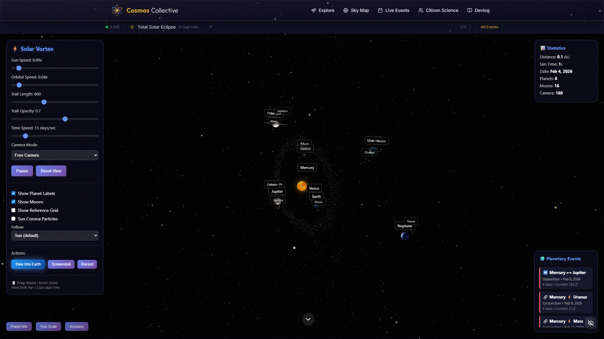

# Cosmos Collective

**[cosmos-collective.com.au](https://cosmos-collective.com.au)**

> A Multi-Spectrum Astronomical Data Exploration Platform

[](https://nextjs.org/)
[](https://www.typescriptlang.org/)
[](https://tailwindcss.com/)
[](LICENSE)
[](https://cosmos-collective.com.au)

Cosmos Collective is an interactive platform for exploring the universe through multiple wavelengths of light. Fly through a 3D solar system, browse JWST's infrared imagery with wavelength switching, map 2,600+ Kepler exoplanets, and explore the sky with real-time data from 11 space agencies.



## Interactive Apps

### JWST Explorer (`/jwst`)
- 3-column interactive viewer for 14 curated James Webb Space Telescope observations
- **Wavelength switching**: Toggle between NIRCam and MIRI infrared views
- **Feature annotations**: Bounding box overlays on Carina Nebula, Pillars of Creation, Stephan's Quintet
- Scientific analysis, coordinates, instrument filters, and external links
- Categories: nebulae, galaxies, deep fields, solar system objects

### Kepler Exoplanet Explorer (`/kepler`)
- Interactive star field of 2,600+ confirmed exoplanets from the NASA Exoplanet Archive
- Three view modes: Sky Map, Galaxy View, HR Diagram
- Filter by planet size, stellar temperature, orbital period, habitable zone
- Orbital diagrams for selected systems with planet properties

### Interactive Solar System (`/solar-system`)
- Real-time 3D solar system with accurate orbital mechanics powered by Three.js
- Zoom out to view our position in the Milky Way galaxy using NASA/JPL-Caltech imagery
- Planet dive mode, adjustable simulation speed, and orbital trail visualisation

### Interactive Sky Map (`/sky-map`)
- Pan and zoom across the entire celestial sphere using Aladin Lite
- Rich popup cards for JWST/Hubble observations with thumbnails and metadata
- Meteor shower radiant overlays with seasonal filtering
- Layer radio, infrared, optical, and X-ray survey data
- Search by object name, coordinates, or constellation

## Additional Features

### Deep Space Observatory (`/observatory`)
- Aitoff-projection sky chart of 33 JWST + Hubble observations
- Three view modes: Sky Map, Distance, Timeline
- Filter by telescope, category, wavelength, and distance

### Explore Gallery (`/explore`)
- Browse all observations with search, category, and wavelength filters
- "View in Sky Map" deep links for spatial context
- Detailed observation pages with analysis and external references

### Real-Time Events (`/events`)
- Live astronomical events: meteor showers, asteroids, solar activity
- ISS tracking with real-time orbital position on a world map
- NASA Astronomy Picture of the Day with expandable explanation
- Near-Earth Object approach diagrams and solar activity gauge

### SKA Showcase
- Interactive timeline of the Square Kilometre Array project
- Comparison bars: current vs. SKA capability metrics
- Live data counter showing SKA's projected throughput

### Australian Telescopes
- Interactive Australia map with 5 telescope markers (ASKAP, MWA, Parkes, ATCA, SKA-Low)
- Murchison cluster grouping with detail cards
- CASDA live data integration for ASKAP observations

## Architecture

```
cosmos-collective-v2/
├── src/
│   ├── app/                    # Next.js App Router
│   │   ├── jwst/              # JWST Explorer
│   │   ├── kepler/            # Kepler Exoplanet Explorer
│   │   ├── solar-system/      # 3D Solar System
│   │   ├── sky-map/           # Interactive Sky Map
│   │   ├── observatory/       # Deep Space Observatory
│   │   ├── explore/           # Observation gallery
│   │   ├── events/            # Live events
│   │   ├── devlog/            # Technical blog
│   │   └── api/               # API routes
│   ├── components/
│   │   ├── ui/                # Base UI components
│   │   ├── features/          # Feature-specific components
│   │   │   ├── jwst/          # JWST viewer
│   │   │   ├── kepler/        # Kepler viewer + canvas
│   │   │   ├── observatory/   # Observatory viewer
│   │   │   ├── explore/       # Gallery + filters
│   │   │   ├── sky-map/       # Aladin Lite integration
│   │   │   ├── events/        # Event components
│   │   │   └── dashboard/     # User dashboard
│   │   ├── layout/            # Header, Footer, navigation
│   │   └── accessibility/     # A11y components
│   ├── services/              # API integrations
│   │   ├── mast-api.ts        # STScI MAST API (JWST + Hubble)
│   │   ├── australian-telescopes.ts
│   │   └── real-time-events.ts
│   ├── hooks/                 # Custom React hooks
│   ├── lib/                   # Utilities
│   └── types/                 # TypeScript definitions
├── public/
│   └── solar-system/          # Three.js solar system (standalone)
└── ...config files
```

## Getting Started

### Prerequisites

- Node.js 18.17 or later
- npm, yarn, or pnpm

### Installation

```bash
# Clone the repository
git clone https://github.com/m4cd4r4/cosmos-collective-v2.git
cd cosmos-collective-v2

# Install dependencies
npm install

# Copy environment variables
cp .env.example .env.local

# Start development server
npm run dev
```

Open [http://localhost:3000](http://localhost:3000) to view the app.

### Environment Variables

See `.env.example` for all available configuration options. At minimum:

- `NEXTAUTH_SECRET`: Generate with `openssl rand -base64 32`
- `NEXT_PUBLIC_NASA_API_KEY`: Get free at [api.nasa.gov](https://api.nasa.gov/)

## Data Sources

| Source | Data Type | Access |
|--------|-----------|--------|
| [STScI MAST](https://mast.stsci.edu/) | JWST, Hubble observations | Public API |
| [NASA Exoplanet Archive](https://exoplanetarchive.ipac.caltech.edu/) | Kepler exoplanets | Public TAP |
| [CSIRO CASDA](https://casda.csiro.au/) | ASKAP radio data | Public TAP |
| [NASA APIs](https://api.nasa.gov/) | APOD, NEO, ISS position | Free API key |
| [NOAA SWPC](https://www.swpc.noaa.gov/) | Space weather | Public |
| [Aladin Lite](https://aladin.cds.unistra.fr/) | Sky survey imagery | Public |

## Design System

### Colour Palette - "Cosmic Optimism"

| Colour | Hex | Usage |
|-------|-----|-------|
| Void | `#030014` | Primary background |
| Solar Gold | `#d4af37` | Primary accent, JWST theme |
| Stellar Cyan | `#06b6d4` | Secondary accent, radio waves |
| Aurora Purple | `#a855f7` | Tertiary, UV representation |
| Nebula Pink | `#ec4899` | Highlights, infrared |

### Typography

- **Display**: Space Grotesk - Headlines and branding
- **Body**: Inter - Body text and UI
- **Mono**: JetBrains Mono - Code and data

## Deployment

### Vercel (Recommended)

[](https://vercel.com/new/clone?repository-url=https://github.com/m4cd4r4/cosmos-collective-v2)

**Live**: [cosmos-collective.com.au](https://cosmos-collective.com.au)

```bash
# Build for production
npm run build

# Start production server
npm run start
```

## Contributing

Contributions are welcome!

1. Fork the repository
2. Create your feature branch (`git checkout -b feature/amazing-feature`)
3. Commit your changes (`git commit -m 'Add amazing feature'`)
4. Push to the branch (`git push origin feature/amazing-feature`)
5. Open a Pull Request

## Learn More

- [Technical Devlog](https://cosmos-collective.com.au/devlog) - Implementation details and decisions
- [SKA Observatory](https://www.skao.int/) - Learn about the Square Kilometre Array
- [STScI](https://www.stsci.edu/) - Space Telescope Science Institute
- [CSIRO ATNF](https://www.atnf.csiro.au/) - Australia Telescope National Facility

## License

This project is licensed under the MIT License - see the [LICENSE](LICENSE) file for details.

## Acknowledgments

- **NASA/ESA/CSA/STScI** - JWST and Hubble imagery and data
- **NASA Exoplanet Archive** - Kepler mission data
- **CSIRO** - Australian radio telescope data
- **CDS Strasbourg** - Aladin Lite sky viewer
- **Open source community** - For the tools and libraries

---

<p align="center">
  <a href="https://cosmos-collective.com.au">Live Site</a> &bull;
  <a href="https://cosmos-collective.com.au/devlog">Devlog</a>
</p>
