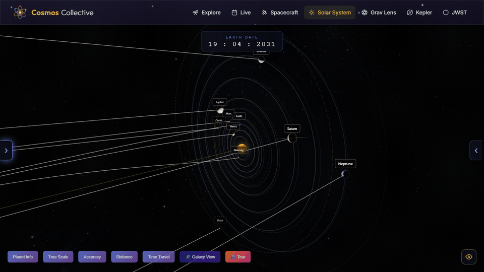
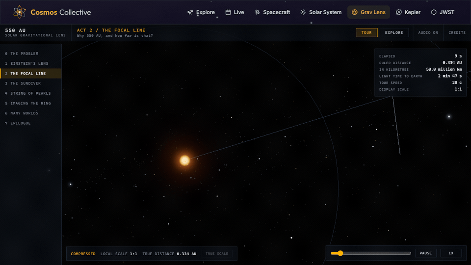

<div align="center">

# Cosmos Collective

### Real astronomical data, made to explore.

Fly a 3D solar system, image an exoplanet through the Sun's own gravity, browse JWST's infrared sky, and map 2,700+ Kepler worlds. Every datum is real, sourced, and dated - drawn live from NASA, ESA, STScI, NOAA, and CSIRO.

[](https://cosmos-collective.com.au)
[](https://nextjs.org/)
[](https://react.dev/)
[](https://www.typescriptlang.org/)
[](https://threejs.org/)
[](LICENSE)

**[cosmos-collective.com.au](https://cosmos-collective.com.au)**

<br />



<sub>The Solar System explorer - real orbital mechanics, 8 planets, 16 tidally-locked moons, a true-scale toggle, and an Earth Dive.</sub>

</div>

---

## What's inside

Eight explorers, one dark-sky instrument aesthetic. Deep space void backgrounds, stellar-gold accents, tabular data readouts. Built for the curious - a 14-year-old can navigate it, and the numbers are all real.

| Explorer | Route | What it does |
|----------|-------|--------------|
| **Solar System** | `/solar-system` | Photorealistic 3D orbits, true-scale toggle, galaxy zoom-out, Earth Dive |
| **Gravitational Lens Telescope** | `/gravitational-lens` | The Solar Gravitational Lens mission concept, act by act |
| **JWST Explorer** | `/jwst` | 85 Webb observations with NIRCam/MIRI wavelength switching |
| **Kepler Exoplanets** | `/kepler` | 2,700+ confirmed worlds in an interactive stellar field |
| **Sky Map** | `/sky-map` | The whole celestial sphere across radio, infrared, optical, and X-ray |
| **Explore Gallery** | `/explore` | 132 curated JWST, Hubble, and Australian radio observations |
| **Live Events** | `/events` | Live ISS position, solar weather, meteor showers, launches |
| **Spacecraft** | `/spacecraft` | Space telescopes, probes, and stations reference |

---

## The Gravitational Lens Telescope

<div align="center">



</div>

A standalone, interactive walkthrough of the **Solar Gravitational Lens** mission concept (NASA/JPL NIAC, Turyshev et al) - flying a solar-sail spacecraft past 650 AU to use the Sun's gravity as a lens and image an exoplanet's surface. Eight acts, each with a scripted **Tour** and a free-camera **Explore** mode: why JWST can't do this, how gravity bends light, the focal line, the sundiver trajectory, the string of pearls, the Einstein-ring imaging dance, the real stellar neighbourhood, and a lens-to-lens comms epilogue.

Real physics throughout (test-verified against published anchors), dramatised visuals clearly labelled as such. It is a separate Vite + Three.js app ([m4cd4r4/550-AU](https://github.com/m4cd4r4/550-AU)), built and vendored into `public/embeds/` and served in a same-origin iframe - fully offline, no external calls at runtime.

---

## Feature highlights

**Solar System** - accurate orbital mechanics, an Earth Dive descent, and a **True Scale** toggle that rescales all 8 planets and 16 moons to their real relative sizes (Phobos and Deimos shrink to near-invisible captured-asteroid specks). Every moon stays tidally locked, keeping one face to its parent. Zoom out to see the Sun's place in the Milky Way.

**JWST Explorer** - 85 curated Webb observations with NIRCam/MIRI wavelength switching, feature annotations scoped precisely to image bounds, a Hubble comparison mode, and deep links into the Sky Map.

**Kepler Exoplanets** - a live NASA Exoplanet Archive query rendering 2,700+ confirmed planets across Sky, Galaxy, and HR-diagram views. Opens on a genuinely weird world (Kepler-16b, the real Tatooine) with the full catalogue one click away. Filter by size, stellar temperature, orbital period, and habitable zone.

**Sky Map** - the entire celestial sphere via Aladin Lite, with a first-class spectrum switcher (CMB, mid-IR, near-IR, optical, UV, gamma) and a live RA/Dec/FoV readout. Search any object; JWST markers deep-link back to their observation pages.

**Live Events** - real ISS position on a world map, a live solar-activity gauge from NOAA SWPC, upcoming meteor showers, launches from Launch Library 2, and NASA's Astronomy Picture of the Day.

---

## Tech stack

| Layer | Choice |
|-------|--------|
| Framework | Next.js 14 (App Router), React 18, TypeScript (strict) |
| Styling | Tailwind CSS 3, Radix UI primitives |
| 3D / viz | Three.js (r183), Aladin Lite, Leaflet, HTML canvas |
| State / data | Zustand, TanStack Query |
| Motion | Framer Motion + CSS keyframes (reduced-motion honoured) |
| Platform | PWA (offline-capable), Vercel |

---

## Data sources

Every readout is real and attributed. Nothing is invented or decorative.

| Source | Data | Access |
|--------|------|--------|
| [STScI MAST](https://mast.stsci.edu/) | JWST, Hubble observations | Public API |
| [NASA Exoplanet Archive](https://exoplanetarchive.ipac.caltech.edu/) | Kepler exoplanets | Public TAP |
| [NASA APIs](https://api.nasa.gov/) | APOD, Near-Earth Objects | API key (server-side) |
| [NOAA SWPC](https://www.swpc.noaa.gov/) | Solar X-ray flux, space weather | Public |
| [Where the ISS at](https://wheretheiss.at/) | Live ISS position | Public |
| [Launch Library 2](https://thespacedevs.com/llapi) | Upcoming launches | Public |
| [Aladin Lite / CDS](https://aladin.cds.unistra.fr/) | Multi-wavelength sky surveys | Public |
| [CSIRO CASDA](https://casda.csiro.au/) | ASKAP radio data | Public TAP |

---

## Design system

Dark-first, always. Deep space void backgrounds with astronomy-authentic accents pulled from real emission lines and stellar cores.

| Role | Token | Hex |
|------|-------|-----|
| Deep space void | `cosmos-void` | `#0a0e1a` |
| Stellar gold (primary) | `cosmos-gold` | `#d4af37` |
| Infrared amber | `cosmos-amber` | `#ff9a3c` |
| Reflection-nebula blue | `cosmos-nebula-blue` | `#4a90e2` |
| H-alpha red | `cosmos-hydrogen` | `#ff6b6b` |

**Type:** Outfit (display) · Inter (body) · JetBrains Mono (data and timestamps, tabular numerals). WCAG 2.1 AA, keyboard navigable, `prefers-reduced-motion` treated as a first-class experience.

---

## Getting started

```bash
git clone https://github.com/m4cd4r4/cosmos-collective-v2.git
cd cosmos-collective-v2

npm install
cp .env.example .env.local   # add NASA_API_KEY (free at api.nasa.gov)

npm run dev
```

Open [http://localhost:3000](http://localhost:3000).

The Gravitational Lens embed is a vendored build. To refresh it after an upstream change, see [`public/embeds/gravitational-lens/README.md`](public/embeds/gravitational-lens/README.md).

### Scripts

| Command | Does |
|---------|------|
| `npm run dev` | Development server |
| `npm run build` | Production build (type-checked and linted) |
| `npm run start` | Serve the production build |
| `npm test` | Vitest unit tests |
| `npm run type-check` | `tsc --noEmit` |

---

## Deployment

Hosted on Vercel. Production deploys are manual (`vercel --prod`) - pushing to `main` does not auto-deploy.

[](https://vercel.com/new/clone?repository-url=https://github.com/m4cd4r4/cosmos-collective-v2)

---

## Credits

- **NASA / ESA / CSA / STScI** - JWST and Hubble imagery and data
- **NASA Exoplanet Archive** - Kepler mission data
- **NOAA SWPC** - space weather
- **CSIRO** - Australian radio telescope data
- **CDS Strasbourg** - Aladin Lite sky viewer
- **[550-AU](https://github.com/m4cd4r4/550-AU)** - the embedded Solar Gravitational Lens simulation (MIT)
- The open-source community, for the tools that made this possible

## License

MIT - see [LICENSE](LICENSE).

<div align="center">
<br />
<a href="https://cosmos-collective.com.au">Live Site</a> &bull;
<a href="https://cosmos-collective.com.au/devlog">Devlog</a> &bull;
<a href="https://cosmos-collective.com.au/gravitational-lens">Gravitational Lens</a>
</div>
